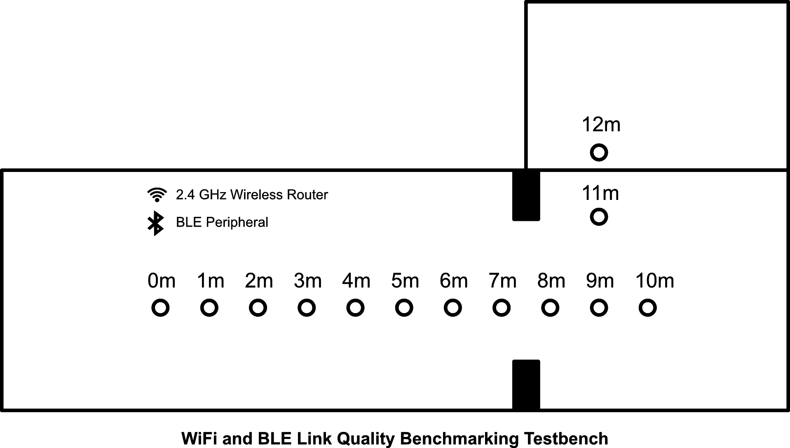
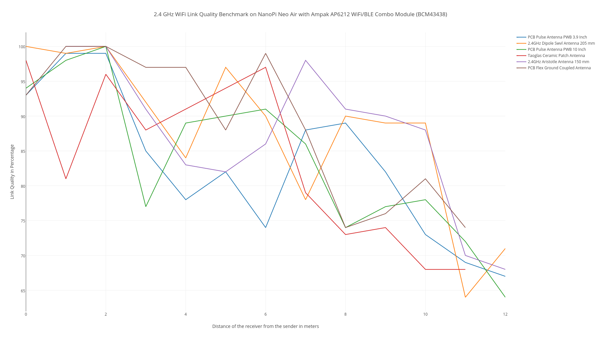
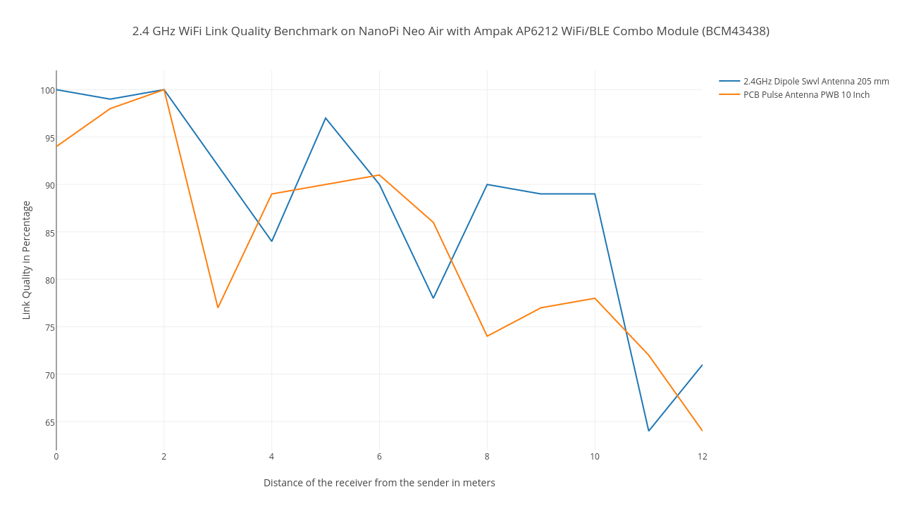
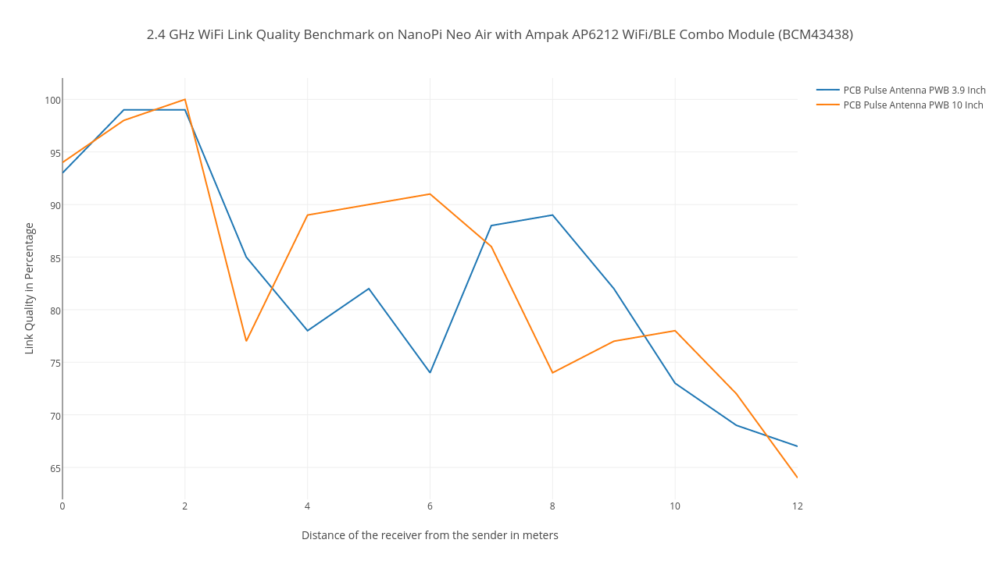
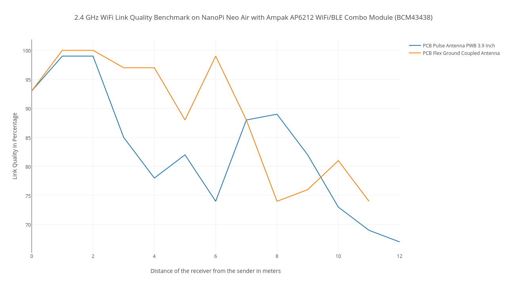
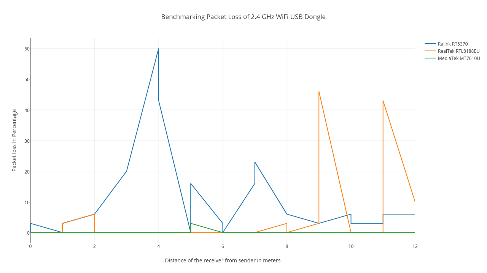
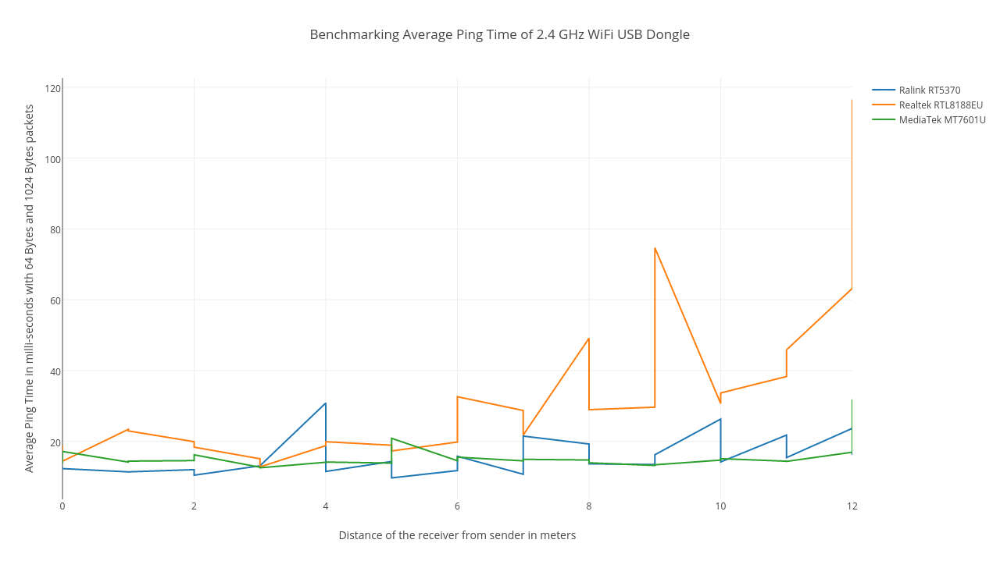
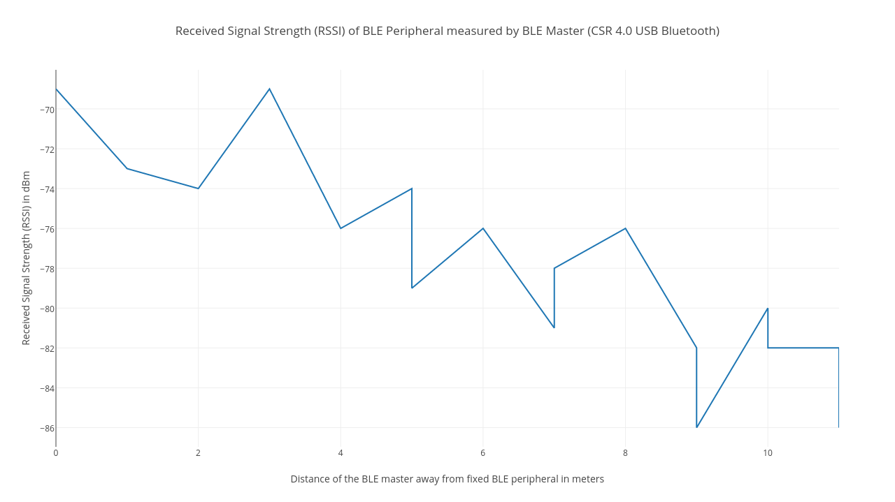
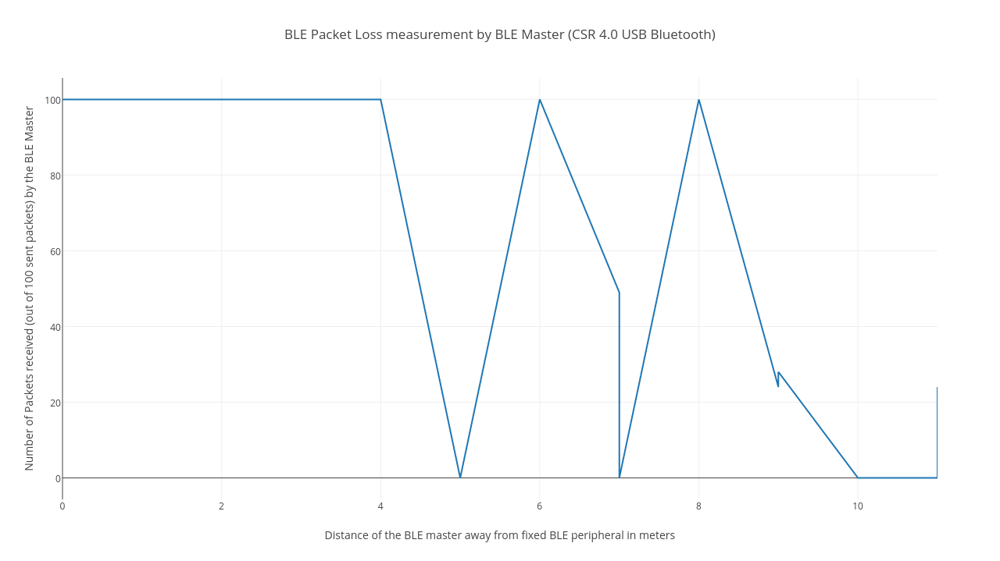
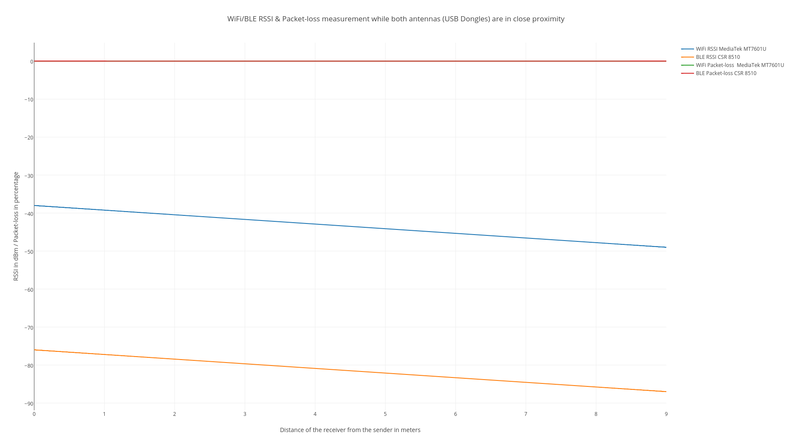

# WiFi and BLE Link Quality Benchmarking

## Author
Aravinth Panchadcharam

## Test Platforms
### MacBook Pro (Mid 2014)
- OS: MacOS 10.12.3
- NIC: AirPort Extreme
- Driver: bcm43xx

### [NanoPi Neo Air](http://wiki.friendlyarm.com/wiki/index.php/NanoPi_NEO_Air)
- OS: Ubuntu 16.04.1 LTS (Ubuntu Core with Qt Embedded by Friendly ARM)
- Kernel: 3.4.39-h3
- NIC: [Ampak AP6212](http://wiki.friendlyarm.com/wiki/images/5/57/AP6212_V1.1_09022014.pdf)
- Driver: bcm43438
- [Board Bringup](./docs/board-bringup.md#nanopi)

### [DragonBoard 410c](http://www.96boards.org/product/dragonboard410c)
- OS: Linaro Debian Jessie
- Kernel: 4.4.23
- NIC: [Qualcomm WCN3620](https://developer.qualcomm.com/download/sd410/wcn3620-wireless-connectivity-ic-device-revision-guide.pdf)
- Driver: wcn36xx

### [C.H.I.P Pro](https://docs.getchip.com/chip_pro.html)
- OS: Debian Builtroot
- Kernel: 
- NIC: [Realtek RTL8723DS](https://github.com/NextThingCo/RTL8723DS)
- Driver: rtl8723DS

### [Onion Omega2+](https://docs.onion.io/omega2-docs/first-time-setup.html)
- OS: OpenWrt
- Kernel: 
- NIC: 
- Driver: 

### [BeagleBone Green Wireless](http://wiki.seeed.cc/BeagleBone_Green_Wireless)
- OS: Debian 
- Kernel: 
- NIC: [Texas Instruments (TI) WL1835MOD](http://www.ti.com/product/WL1835MOD)
- Driver: wl18xx

### [Orange Pi Zero](http://www.orangepi.org/orangepizero)
- OS: Armbian Ubuntu Jessie 
- Kernel: 3.4.113-sun8i
- NIC: [Allwinner XR819]()
- Driver: xradio

### [FINOO USB nano Bluetooth-Adapter V4.0](https://www.amazon.de/dp/B0173EFI02)
- NIC: [Cambridge Silicon Radio (CSR) 8510 A10](http://www.csr.com/products/bluecore-csr8510-a10-wlcsp)
- Driver: btusb

### [MAXAH WLAN Dongle USB](https://www.amazon.de/Adapter-Wireless-drahtlos-802-11b-Stick-Aktionspreis/dp/B010V6WKSM)
- NIC: [MediaTek MT7601U](https://www.mediatek.com/products/broadbandWifi/mt7601u)
- Driver: mt7601u

### [TP-Link TL-WN725N Nano WLAN USB](https://www.amazon.de/TP-Link-TL-WN725N-Adapter-150Mbit-geeignet/dp/B008IFXQFU)
- NIC: [Realtek RTL8188EUS](http://www.cnping.com/wp-content/uploads/2015/09/RTL8188CUS_DataSheet_1.01.pdf)
- Driver: r8188eu

### [Racksoy Professionell Wifi Dongle USB ](https://www.amazon.de/Racksoy-Professionell-Wireless-Kompatibel-Raspberry/dp/B00X538ONY)
- NIC: [Ralink (MediaTek) RT5370](https://wikidevi.com/wiki/Ralink)
- Driver: rt2800usb

### [CSL 300 Mbit/s WLAN Stick Gold Edition C103 with external Antenna](https://www.amazon.de/gp/product/B00B4TUEYI)
- NIC: [Realtek RTL8191SU](http://www.realtek.com.tw/products/productsView.aspx?Conn=4&Langid=1&Level=5&PFid=48&ProdID=229)
- Driver: r8712u

### [Supremery - 2 in1 WLAN Stick 150Mbps USB - WiFi/BLE Combo](https://www.amazon.de/gp/product/B01H3AA7U2)
- NIC: [Realtek]()
- Bluetooth Driver: rtl8723b

### [Philonext Wifi Dongle 600Mbps, AC600Mbps Dual Band](https://www.amazon.de/gp/product/B01H3AA7U2)
- NIC: [Realtek RTL8811AU](https://github.com/gnab/rtl8812au)
- Bluetooth Driver: r8812au

## Antenna Mapping
- 1 => PCB Pulse Antenna PWB 3.9 Inch - W3525B039 - [Datasheet](http://www.mouser.com/ds/2/336/-268322.pdf)
- 2 => 2.4GHz Dipole Swvl Antenna 205 mm - 0600-00057 - [Datasheet](http://www.mouser.de/ProductDetail/Laird-Technologies/0600-00057)
- 3 => PCB Pulse Antenna PWB 10 Inch - W3525B100 - [Datasheet](http://www.mouser.com/ds/2/336/-268322.pdf)
- 4 => Taoglas Ceramic Patch Antenna - WPC.25A.07.0150C - [Datasheet](http://www.mouser.com/ds/2/398/WPC.25A.07.0150C-13093.pdf)
- 5 => 2.4GHz Aristotle Antenna 150 mm RFA02-L2H1 - TRF1001 - [Datasheet](http://www.mouser.com/ds/2/268/microchip_RFA-02-L2H1-519877.pdf)
- 6 => PCB Flex Ground Coupled Antenna - FXP72.07.0053A - [Datasheet](http://www.mouser.com/ds/2/398/FXP72.07.0053A%202.4GHz%20Flex%20Circuit%20PCB%20050110-20322.pdf)
- 7 => 2.4GHz Dipole Swvl Antenna 104 mm - 0600-00057 - [Datasheet](http://www.mouser.de/ProductDetail/Laird-Technologies/0600-00057)

## TestBench
Testbench is created by linearly distributing spatial points where measurements are carried out as shown in the graph below. Wireless router of 2.4 GHz is placed at reference location and marked as 0th meter. There is a huge architectural beam between 7th and 8th meter. System Under Test (SUT) is moved manually with power plugged in and connected to a host computer via Serial Port. For the Bluetooth Low Energy measurements, BLE Peripheral is places at the reference location next to the router.

## Benchmark Results
### NanoPi Neo Air
WiFi Link Quality Benchmark on NanoPi Neo Air with Ampak AP6212 WiFi/BLE Combo Module (BCM43438). Measurements were carried out at marked measurement points with different antennas. Measurement consists of scanning RSSI and Link Quality metrics from "/proc/net/wireless" in Linux.

#### 2.4GHz Dipole Swvl Antenna 205 mm Vs PCB Pulse Antenna PWB 10 Inch

#### PCB Pulse Antenna PWB 3.9 Inch Vs PCB Pulse Antenna PWB 10 Inch

#### PCB Pulse Antenna PWB 3.9 Inch Vs PCB Flex Ground Coupled Antenna

### WiFi USB Dongle
Packet loss of WiFi USB dongles with chipset of MediaTek MT7601U, Realtek RTL8188EU and Ralink RT5370 were measured by pinging (ICMP Message) to a host in internet with 64 Bytes and 1024 Bytes packets 30 times. **MediaTek MT7601U performed very well** by having 6% packet loss only at 12th meter as shown in the graph below.

Average ping time with different dongles are shown below. 30 counts of ICMP messages with packet size of 64 Bytes and 1024 Bytes respectively are pinged. **MediaTek MT7601U** had consistently the same ping time as shown in the graph below.

### Bluetooth USB Dongle

Graph below shows Received Signal Strength (RSSI) of BLE Peripheral measured by BLE Master which is a USB Bluetooth Dongle with CSR 8510 Chipset. BLE Peripheral is places at the reference location at 0th meter.

BLE master (CSR 8510) connects to BLE Peripheral at reference location and subscribes for a HeartBeat service to receive 100 packets with size of 1 Byte. Measurement was carried out at different measurement points to test how many packets are successfully received by the BLE master as shown in the graph below. Locations where it received zero number of packets are the locations where BLE master was not able to initiate the connection to the peripheral and needed to scan once again before connection. BLE peripheral stops sending packets after 100th packet is sent. **CSR 8510 was able to capture all the packets at any distance within 10 meters.**

However another test was carried out where peripheral continuously sent packets to a master that has initiated the connection at 0th meter and **master was able to keep the connection more than 25 meters with 40% packet loss.**

### Coexistence of WiFi and Bluetooth USB dongles in close proximity
WiFi dongle (MediaTek MT7601U) and BLE dongle (CSR 8510) were attached to USB ports of the host system which are located close to each other. Test was carried out to examine whether both antennas of USB dongles interfere with each other while both interfaces are actively sending/receiving. Coexistence of WiFi & BLE USB dongles didn’t interfere at all. They had zero packet-loss and good RSSI as shown in the graph.

